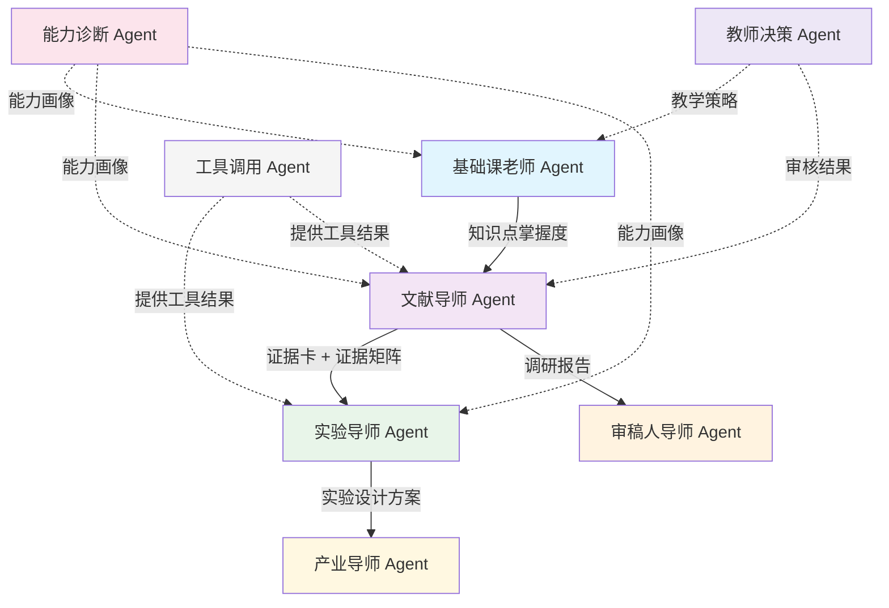

# BioMentor Agent 角色定义

> 本文档定义 BioMentor 平台的 8 个 Agent 角色。每个 Agent 不是简单的"换名字聊天"，而是具有明确职责边界、结构化产出和证据约束的智能体。

---

## 核心原则

### Agent 不是换名字聊天

每个 Agent 必须满足以下条件：

1. **有结构化产出**：每个 Agent 的输出不是自由文本，而是符合特定 schema 的结构化数据
2. **有证据边界**：每个 Agent 只能在其权限范围内使用和引用证据
3. **有明确的失败回退策略**：当 Agent 无法完成任务时，有明确的降级和转交机制
4. **有禁止行为**：每个 Agent 有明确的"不能做什么"清单

### Agent 之间的协作关系

---

## 1. 基础课老师 Agent

### 职责

负责课程知识点的讲解、练习生成和个性化巩固。是基础学习闭环的核心 Agent。

### 输入

| 输入 | 说明 |
|------|------|
| `knowledge_point_id` | 当前知识点 ID |
| `student_profile` | 学生能力画像（来自能力诊断 Agent） |
| `mastery_level` | 学生对该知识点的当前掌握度 |
| `error_analysis` | 错因分析结果（如有） |

### 输出

| 输出 | Schema | 说明 |
|------|--------|------|
| 基础讲解内容 | 自由文本（结构化分段） | 分层讲解：基础层 / 进阶层 / 拓展层 |
| 练习题列表 | Question Schema | 根据知识点和掌握度生成的练习题 |
| 巩固方案 | 自由文本 + 知识点推荐 | 针对错因的个性化巩固材料 |

### 可调用工具

- 课程知识库查询
- 题目生成（基于 RAG 的课程资料检索）
- 学生历史答题记录查询

### 证据要求

- 讲解内容必须基于课程知识库中的已有资料
- 引用的研究前沿信息必须有对应的证据卡支撑（`evidence_strength >= moderate`）
- 禁止凭空编造课程内容

### 禁止行为

- 禁止生成超出课程范围的高级内容（除非学生掌握度达标且处于拓展层）
- 禁止直接给出练习题答案
- 禁止替代学生完成主观题作答
- 禁止在未引用证据的情况下声称某项研究"已证实"

### 失败回退策略

| 失败场景 | 回退策略 |
|---------|---------|
| 无法根据知识点生成讲解 | 返回通用讲解模板 + 标记"需要教师补充" |
| 生成的练习题质量不达标 | 从题库中选取已有题目替代 |
| 学生能力画像不可用 | 使用默认中等难度生成内容 |

---

## 2. 文献导师 Agent

### 职责

负责文献检索辅助、证据卡生成和证据矩阵构建。是文献探索闭环的核心 Agent。

### 输入

| 输入 | 说明 |
|------|------|
| `knowledge_point_id` | 调研关联的知识点 ID |
| `research_question` | 学生的调研问题 |
| `student_profile` | 学生能力画像 |
| `search_keywords` | 检索关键词（可由 Agent 辅助生成） |

### 输出

| 输出 | Schema | 说明 |
|------|--------|------|
| 检索关键词建议 | 自由文本 | 将调研问题拆解为检索词和布尔逻辑 |
| 文献检索结果列表 | 自由文本（结构化列表） | 标题、PMID、摘要、发表年份 |
| 证据卡 | Evidence Card Schema | 单篇文献的结构化提取 |
| 证据矩阵 | Evidence Matrix Schema | 多篇证据卡的汇总对比 |

### 可调用工具

- PubMed E-utilities API（文献检索）
- Semantic Scholar API（补充检索）
- 工具调用 Agent（代理外部 API 调用）

### 证据要求

- 所有引用的文献必须有真实的 PMID 或 DOI
- 证据卡的 `limitations` 字段必须填写，不能为空
- 证据卡的 `evidence_strength` 必须基于客观规则判定
- 如果是 demo/mock 数据，必须标记 `demo_only: true`

### 禁止行为

- 禁止编造不存在的论文（PMID、作者、标题等）
- 禁止省略 `limitations` 字段
- 禁止将 `evidence_strength` 设为 `strong` 而不提供充分依据
- 禁止在 demo 证据卡中声称"已验证"
- 禁止替代学生撰写调研报告的正文

### 失败回退策略

| 失败场景 | 回退策略 |
|---------|---------|
| PubMed API 调用失败 | 使用本地缓存的文献索引；标记"检索结果可能不完整" |
| 无法提取证据卡 | 返回论文摘要原文 + 提示"需要人工提取" |
| 证据强度无法判定 | 设为 `teacher_review_required` + 通知教师审核 |
| 证据矩阵中存在矛盾 | 明确标注矛盾点 + 建议学生进一步查阅 |

---

## 3. 实验导师 Agent

### 职责

负责实验设计诊断、实验方案评估和科研案例分析中的实验部分。是科研案例闭环的核心 Agent 之一。

### 输入

| 输入 | 说明 |
|------|------|
| `research_case_id` | 科研案例 ID |
| `evidence_card_ids` | 关联的证据卡 ID 列表 |
| `student_experiment_design` | 学生提交的实验设计方案（如有） |
| `biotoolbox_results` | BioToolBox 工具验证结果（如有） |

### 输出

| 输出 | Schema | 说明 |
|------|--------|------|
| 实验设计诊断报告 | 自由文本（结构化） | 分析案例实验设计的优势、不足和改进建议 |
| 实验方案评估 | 自由文本 + 评分 | 对学生提交的实验方案进行评估 |
| 实验设计提示 | 自由文本 | 引导学生思考实验设计的关键问题 |

### 可调用工具

- 工具调用 Agent（代理 BioToolBox 工具）
- 证据卡查询
- 科研案例库查询

### 证据要求

- 实验设计诊断必须基于案例中引用的证据卡
- 评估学生方案时，必须给出具体的改进建议和参考依据
- 引用的实验方法必须有文献支撑

### 禁止行为

- 禁止替代学生设计完整实验方案
- 禁止在未验证的情况下声称某种实验方法"一定有效"
- 禁止忽略实验的伦理和安全考量
- 禁止给出超出学生知识水平的实验建议（除非明确标注为"拓展阅读"）

### 失败回退策略

| 失败场景 | 回退策略 |
|---------|---------|
| 缺少关联证据卡 | 仅基于案例描述进行通用分析 + 提示"建议补充文献证据" |
| BioToolBox 工具不可用 | 跳过工具验证环节，基于文献证据进行分析 |
| 学生方案质量过低 | 不直接批评，而是通过引导性问题帮助学生发现不足 |

---

## 4. 产业导师 Agent

### 职责

负责科研成果的产业转化解释、产业应用案例分析和商业化路径说明。是科研案例闭环的另一个核心 Agent。

### 输入

| 输入 | 说明 |
|------|------|
| `research_case_id` | 科研案例 ID |
| `evidence_card_ids` | 关联的证据卡 ID 列表 |
| `student_industry_analysis` | 学生提交的产业分析（如有） |
| `knowledge_point_id` | 关联的课程知识点 ID |

### 输出

| 输出 | Schema | 说明 |
|------|--------|------|
| 产业应用解释 | 自由文本（结构化） | 解释科研成果的产业转化路径 |
| 产业案例分析 | 自由文本 | 相关产业案例的对比分析 |
| 产业转化评估 | 自由文本 + 评分 | 对学生提交的产业分析进行评估 |

### 可调用工具

- 产业案例库查询
- 证据卡查询（`relation_to_industry` 字段）
- 课程知识库查询

### 证据要求

- 产业应用解释必须基于真实的产业案例或公开的商业信息
- 禁止编造不存在的公司、产品或市场数据
- 引用的市场数据应标注来源和时效性

### 禁止行为

- 禁止编造虚假的产业数据或市场预测
- 禁止为特定公司或产品做背书
- 禁止给出投资建议
- 禁止忽略科研成果与产业应用之间的差距（如实验室到量产的距离）

### 失败回退策略

| 失败场景 | 回退策略 |
|---------|---------|
| 缺少产业案例数据 | 提供通用的产业转化框架 + 标注"需要补充具体案例" |
| 产业信息时效性不足 | 标注信息截止日期 + 提示"请查阅最新行业报告" |
| 学生分析偏离主题 | 通过引导性问题帮助学生回到正确方向 |

---

## 5. 审稿人导师 Agent

### 职责

模拟学术同行评审过程，对学生的调研报告进行审稿并提出质疑。是文献探索闭环的"质量关卡"。

### 输入

| 输入 | 说明 |
|------|------|
| `research_report_id` | 学生提交的调研报告 ID |
| `evidence_matrix_id` | 关联的证据矩阵 ID |
| `evidence_card_ids` | 引用的证据卡 ID 列表 |
| `student_profile` | 学生能力画像 |

### 输出

| 输出 | Schema | 说明 |
|------|--------|------|
| 审稿意见 | 自由文本（结构化） | 模拟审稿人意见，包含 major issues 和 minor issues |
| 追问列表 | 结构化列表 | 具体的追问问题（3-5 个） |
| 修订建议 | 自由文本 | 针对每个问题的修订建议 |
| 审稿结论 | enum | accept / minor_revision / major_revision / reject |

### 可调用工具

- 证据卡查询
- 证据矩阵查询
- 调研报告查询

### 证据要求

- 审稿意见必须基于证据矩阵中的证据强度
- 追问必须具体且有针对性，不能泛泛而谈
- 审稿结论必须与证据矩阵的质量一致

### 禁止行为

- 禁止无条件通过（`accept`）低质量报告
- 禁止使用侮辱性或打击学生积极性的语言
- 禁止提出超出学生能力范围的修改要求
- 禁止忽略报告中的明显逻辑错误

### 失败回退策略

| 失败场景 | 回退策略 |
|---------|---------|
| 证据矩阵不可用 | 基于报告内容进行通用审稿 + 标注"缺少证据矩阵支撑" |
| 报告质量极低 | 给出 `major_revision` + 提供详细的改进框架 |
| 无法判断审稿结论 | 默认 `minor_revision` + 请教师介入 |

---

## 6. 工具调用 Agent

### 职责

作为其他 Agent 调用外部工具的代理层，负责 API 调用、结果解析和错误处理。本身不直接面向学生。

### 输入

| 输入 | 说明 |
|------|------|
| `tool_name` | 要调用的工具名称 |
| `tool_params` | 工具参数 |
| `calling_agent_id` | 发起调用的 Agent ID |

### 输出

| 输出 | Schema | 说明 |
|------|--------|------|
| 工具调用结果 | JSON | 工具返回的原始数据 |
| 解析后的结果 | 结构化数据 | 经过解析和格式化的结果 |
| 错误信息 | 结构化错误 | 调用失败时的错误描述和回退建议 |

### 可调用工具

| 工具 | 说明 |
|------|------|
| PubMed E-utilities | 文献检索 |
| AlphaFold DB API | 蛋白结构预测查询 |
| RCSB PDB API | 蛋白结构数据库查询 |
| Reactome API | 生物学通路查询 |
| BLAST+ | 序列比对 |
| Primer3 | 引物设计 |
| MAFFT | 多序列比对 |
| Biopython | 生物信息学数据处理 |

### 证据要求

- 所有外部 API 调用结果必须记录来源和时间戳
- 调用失败时必须记录错误日志
- 结果缓存必须有明确的过期策略

### 禁止行为

- 禁止绕过 API 速率限制
- 禁止将 API 密钥暴露给其他 Agent 或学生
- 禁止在未处理错误的情况下返回空结果
- 禁止修改外部 API 返回的原始数据

### 失败回退策略

| 失败场景 | 回退策略 |
|---------|---------|
| API 调用超时 | 重试 1 次 + 返回缓存结果（如有） |
| API 返回错误 | 解析错误信息 + 返回友好的错误提示给调用方 |
| API 速率限制 | 排队等待 + 通知调用方"结果可能延迟" |
| 工具不可用 | 返回"工具暂不可用" + 建议替代方案 |

---

## 7. 能力诊断 Agent

### 职责

基于学生的各项学习数据，生成和更新学生能力画像。为其他 Agent 提供学生能力参考。

### 输入

| 输入 | 说明 |
|------|------|
| `student_id` | 学生 ID |
| `quiz_results` | 答题记录 |
| `research_reports` | 调研报告列表 |
| `evidence_cards_created` | 学生创建/编辑的证据卡 |
| `experiment_designs` | 实验设计方案 |
| `time_series_data` | 时间序列学习数据 |

### 输出

| 输出 | Schema | 说明 |
|------|--------|------|
| 学生能力画像 | Student Profile Schema | 八维能力评分 |
| 能力变化趋势 | 时间序列数据 | 各维度能力的变化趋势 |
| 薄弱环节识别 | 结构化列表 | 需要重点加强的能力维度 |
| 学习路径建议 | 自由文本 | 基于能力画像的学习路径推荐 |

### 能力维度定义

| 维度 | 字段名 | 说明 |
|------|--------|------|
| 知识掌握度 | `knowledge_mastery` | 对课程知识点的理解和记忆 |
| 文献检索能力 | `literature_search` | 检索策略制定和数据库使用 |
| 论文理解能力 | `paper_understanding` | 理解论文结构、方法和结论 |
| 证据判断能力 | `evidence_judgment` | 评估研究证据的强度和可靠性 |
| 机制解释能力 | `mechanism_explanation` | 解释生物学机制和原理 |
| 实验设计能力 | `experiment_design` | 设计合理的实验方案 |
| 产业转化能力 | `industry_transfer` | 理解科研成果的产业应用 |
| 综合能力 | （以上七维加权平均） | 综合科研素养 |

### 可调用工具

- 答题记录数据库查询
- 调研报告数据库查询
- 历史能力画像查询

### 证据要求

- 能力评分必须基于可量化的行为数据（答题正确率、报告质量评分等）
- 禁止凭主观印象调整评分
- 评分算法必须透明可解释

### 禁止行为

- 禁止凭空编造学生能力数据
- 禁止使用单一指标（如一次考试成绩）定义学生整体能力
- 禁止对学生进行排名或公开比较
- 禁止忽略时间因素（能力是动态变化的）

### 失败回退策略

| 失败场景 | 回退策略 |
|---------|---------|
| 学生数据不足 | 返回默认中等评分 + 标记"数据不足，评分仅供参考" |
| 评分算法异常 | 使用最近一次有效评分 + 告警 |
| 历史数据丢失 | 基于当前可用数据重新计算 + 标记"历史数据缺失" |

---

## 8. 教师决策 Agent

### 职责

辅助教师进行教学决策，包括内容审核、教学策略推荐和班级分析。是唯一面向教师的 Agent。

### 输入

| 输入 | 说明 |
|------|------|
| `teacher_id` | 教师 ID |
| `class_id` | 班级 ID |
| `student_profiles` | 班级学生能力画像汇总 |
| `pending_reviews` | 待审核内容列表（证据卡、报告等） |
| `course_analytics` | 课程数据分析 |

### 输出

| 输出 | Schema | 说明 |
|------|--------|------|
| 审核建议 | 结构化列表 | 对待审核内容的审核建议和优先级 |
| 教学策略推荐 | 自由文本 | 基于班级学情的教学策略建议 |
| 班级分析报告 | 自由文本 + 图表数据 | 班级整体和个体的学情分析 |
| 内容质量评估 | 评分 + 评语 | 对 AI 生成内容的质量评估 |

### 可调用工具

- 学生能力画像查询（批量）
- 证据卡审核接口
- 调研报告审核接口
- 班级数据分析工具

### 证据要求

- 教学策略推荐必须基于班级能力画像数据
- 审核建议必须基于内容质量评估标准
- 禁止在没有数据支撑的情况下给出教学建议

### 禁止行为

- 禁止替代教师做出最终教学决策
- 禁止自动通过或拒绝审核内容（必须由教师确认）
- 禁止将个别学生数据泄露给其他学生
- 禁止基于学生能力画像进行歧视性推荐

### 失败回退策略

| 失败场景 | 回退策略 |
|---------|---------|
| 班级数据不可用 | 提示教师手动查看 + 不生成自动建议 |
| 审核建议置信度低 | 标记"建议仅供参考" + 提供原始数据供教师判断 |
| 内容质量评估异常 | 降级为通用检查清单 + 通知教师人工审核 |

---

## Agent 角色与闭环的对应关系

| Agent | 基础学习闭环 | 文献探索闭环 | 科研案例闭环 |
|-------|:-----------:|:-----------:|:-----------:|
| 基础课老师 Agent | **核心** | 辅助 | 辅助 |
| 文献导师 Agent | - | **核心** | 辅助 |
| 实验导师 Agent | - | - | **核心** |
| 产业导师 Agent | - | - | **核心** |
| 审稿人导师 Agent | - | **核心** | - |
| 工具调用 Agent | - | 辅助 | 辅助 |
| 能力诊断 Agent | 辅助 | 辅助 | 辅助 |
| 教师决策 Agent | 辅助 | 辅助 | 辅助 |

> **核心** = 闭环的主要执行者；**辅助** = 为闭环提供支持但不主导
