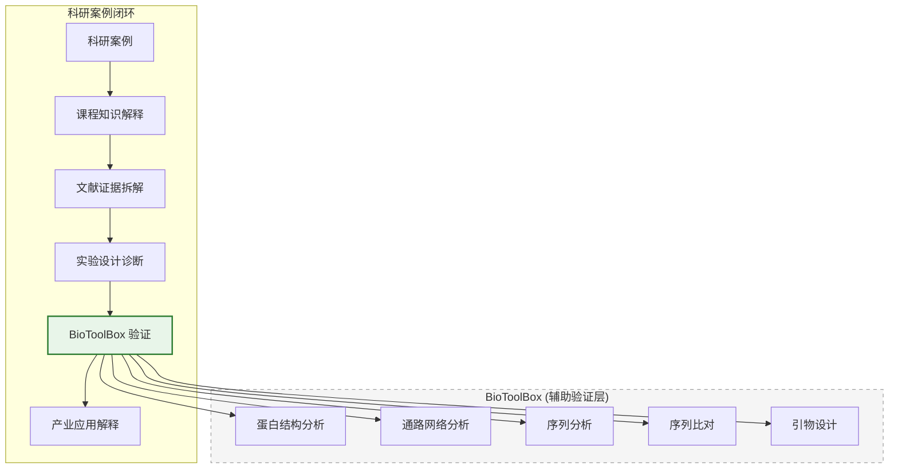
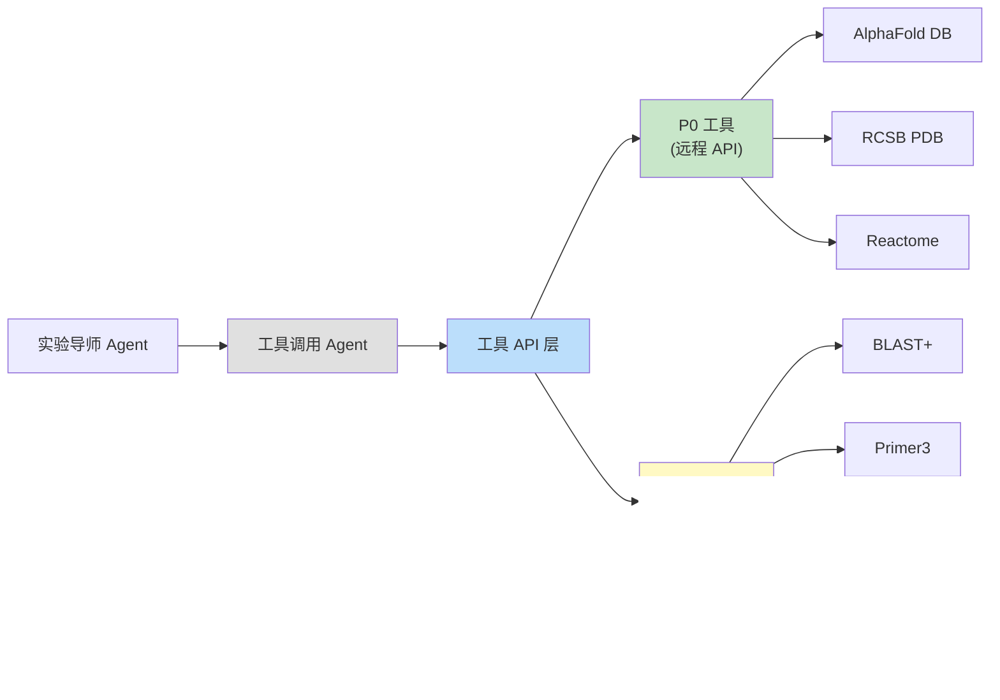

# BioMentor BioToolBox 路线图

> 本文档定义 BioMentor 平台的生物信息学工具箱（BioToolBox）的开发路线图。BioToolBox 是科研训练闭环的**辅助验证层**，不是项目主线本身。

---

## 1. BioToolBox 的定位

### 1.1 核心定位

BioToolBox 是 BioMentor 科研训练体系中的**辅助验证层**，其核心价值在于：

1. **让抽象知识可视化**：将课程中抽象的生物学概念（蛋白结构、信号通路、基因序列）转化为可交互的可视化内容
2. **支撑实验设计诊断**：为实验导师 Agent 提供工具验证能力，帮助学生验证实验假设
3. **降低工具使用门槛**：将专业生物信息学工具封装为教学友好的 Web 界面

### 1.2 BioToolBox 不是什么

- **不是独立的生物信息学分析平台**：BioToolBox 的目标是教学辅助，不是替代专业工具
- **不是项目主线**：BioToolBox 是科研训练闭环的支撑层，主线是三条闭环工作流
- **不是万能工具箱**：只选择对教学有直接价值的工具接入，不做大而全的工具集合

### 1.3 在闭环中的位置

---

## 2. P0 工具（MVP 必须接入）

### 2.1 蛋白质结构可视化

| 属性 | 说明 |
|------|------|
| **工具组合** | AlphaFold DB API + RCSB PDB API + 3Dmol.js |
| **教学场景** | 学生在分析靶点蛋白时，需要直观了解蛋白的三维结构、活性位点和结合口袋。例如：分析 CAR-T 疗法中的靶点蛋白 CD19 的结构特征 |
| **输入** | 蛋白名称 / UniProt ID / PDB ID |
| **输出** | 可交互的 3D 蛋白结构视图（支持旋转、缩放、着色方案切换） |
| **是否本地运行** | 前端渲染（3Dmol.js），数据来自远程 API |
| **隐私/版权风险** | 低。AlphaFold DB 和 RCSB PDB 均为开放数据库，数据可自由使用 |
| **MVP 是否接入** | **是** - 已有前端页面（`frontend/app/student/protein/page.tsx`） |
| **为什么先做** | 蛋白结构是生物制造课程的核心概念，可视化需求最迫切；AlphaFold DB 和 RCSB PDB API 免费且稳定；3Dmol.js 是成熟的 WebGL 渲染库，前端集成成本低 |

#### 技术实现要点

- **AlphaFold DB API**：`https://alphafold.ebi.ac.uk/api/prediction/{uniprot_id}` 返回预测结构 URL
- **RCSB PDB API**：`https://data.rcsb.org/rest/v1/core/entry/{pdb_id}` 返回实验结构数据
- **3Dmol.js**：在浏览器中渲染蛋白结构，支持多种分子表示方式（cartoon、stick、surface 等）
- **降级策略**：如果 AlphaFold DB 不可用，回退到 RCSB PDB；如果两者都不可用，显示"结构数据暂不可用"

### 2.2 生物学通路网络可视化

| 属性 | 说明 |
|------|------|
| **工具组合** | Reactome API + Cytoscape.js |
| **教学场景** | 学生在分析信号通路时，需要直观了解通路中的分子组件和调控关系。例如：分析细胞凋亡通路中 Caspase 级联反应的调控网络 |
| **输入** | 通路名称 / Reactome Pathway ID / 基因列表 |
| **输出** | 可交互的通路网络图（支持节点展开、路径高亮、基因标注） |
| **是否本地运行** | 前端渲染（Cytoscape.js），数据来自 Reactome API |
| **隐私/版权风险** | 低。Reactome 是开放数据库，数据使用 CC BY 4.0 协议 |
| **MVP 是否接入** | **是** - 已有前端页面（`frontend/app/student/pathway/page.tsx`） |
| **为什么先做** | 信号通路是理解生物制造过程（如代谢工程、合成生物学）的基础；Reactome API 免费且数据质量高；Cytoscape.js 是成熟的网络图渲染库 |

#### 技术实现要点

- **Reactome API**：`https://reactome.org/ContentService/data/query/{query}` 支持按通路名、基因名等查询
- **Cytoscape.js**：在浏览器中渲染网络图，支持力导向布局、层级布局等
- **交互功能**：点击节点显示详细信息、高亮特定路径、搜索节点
- **降级策略**：如果 Reactome API 不可用，使用本地缓存的常用通路数据

### 2.3 质粒/序列注释可视化

| 属性 | 说明 |
|------|------|
| **工具组合** | pLannotate + SeqViz / OVE |
| **教学场景** | 学生在设计基因工程实验时，需要可视化和注释质粒载体。例如：分析 pET-28a 表达载体的多克隆位点、抗性基因和启动子位置 |
| **输入** | 质粒序列（FASTA / GenBank 格式）或载体名称 |
| **输出** | 环形质粒图谱（标注基因、启动子、酶切位点等） |
| **是否本地运行** | 前端渲染（SeqViz/OVE），注释分析可本地运行或调用 API |
| **隐私/版权风险** | 中。pLannotate 为开源工具（MIT 协议），但部分载体序列可能涉及商业专利。教学场景下使用公开标准载体序列风险可控 |
| **MVP 是否接入** | **是** - 已有前端页面（`frontend/app/student/plasmid/page.tsx`） |
| **为什么先做** | 质粒操作是分子生物学实验的基础技能；可视化质粒图谱能帮助学生理解载体设计逻辑；pLannotate 是目前最好的开源质粒注释工具 |

#### 技术实现要点

- **pLannotate**：开源质粒注释工具，支持本地运行或 Docker 部署
- **SeqViz**：React 组件库，支持 DNA 序列可视化和注释
- **OVE**：备选方案，功能更丰富的序列可视化工具
- **降级策略**：如果 pLannotate 不可用，使用预定义的常用载体注释数据

---

## 3. P1 工具（下一阶段接入）

### 3.1 BLAST+ 序列比对

| 属性 | 说明 |
|------|------|
| **工具** | NCBI BLAST+ (blastn, blastp, blastx) |
| **教学场景** | 学生需要验证基因序列的特异性、查找同源序列。例如：验证 CRISPR sgRNA 靶序列的唯一性、查找蛋白的同源物 |
| **输入** | 核酸序列或蛋白序列（FASTA 格式） |
| **输出** | 比对结果列表（E-value、score、alignment、hit 描述） |
| **是否本地运行** | 可本地运行（需安装 BLAST+ 和本地数据库）或调用 NCBI BLAST API |
| **隐私/版权风险** | 低。BLAST 是开放工具，NCBI BLAST API 免费使用（有速率限制）。本地运行无隐私风险 |
| **MVP 是否接入** | **否** - P1 阶段接入 |
| **为什么后做** | BLAST 结果的专业性较强，需要较多的结果解析和可视化工作；NCBI BLAST API 有速率限制（3 requests/second），不适合班级并发使用；建议先搭建本地 BLAST 数据库再接入 |

#### P1 实现计划

1. 在后端服务器安装 BLAST+ 并下载常用数据库（nr、nt 子集）
2. 封装 BLAST+ 为 REST API，支持异步提交和结果查询
3. 前端开发比对结果可视化组件（hit table、alignment viewer）
4. 设置结果缓存机制，避免重复查询

### 3.2 Primer3 引物设计

| 属性 | 说明 |
|------|------|
| **工具** | Primer3 / primer3-py |
| **教学场景** | 学生在设计 PCR 实验时需要设计引物。例如：为基因克隆实验设计特异性引物、评估引物的 Tm 值和二级结构 |
| **输入** | 模板序列 + 目标区域 + 参数（产物长度、Tm 范围等） |
| **输出** | 推荐引物列表（正向/反向引物序列、Tm、GC%、产物长度、二级结构预测） |
| **是否本地运行** | **是** - primer3-py 为 Python 库，完全本地运行 |
| **隐私/版权风险** | 无。Primer3 为开源工具（GPLv2），本地运行无数据外泄风险 |
| **MVP 是否接入** | **否** - P1 阶段接入 |
| **为什么后做** | 引物设计是实验操作层面的工具，优先级低于蛋白结构和通路分析；但因为是本地运行，集成成本较低，适合在 P1 快速接入 |

#### P1 实现计划

1. 安装 primer3-py Python 库
2. 封装为 REST API，支持参数自定义
3. 前端开发引物结果展示组件（引物位置标注在序列上、参数表格）
4. 可选：集成 OligoAnalyzer API 进行二级结构分析

### 3.3 MAFFT 多序列比对

| 属性 | 说明 |
|------|------|
| **工具** | MAFFT + MSAViewer |
| **教学场景** | 学生需要进行多序列比对来分析蛋白保守性。例如：比较不同物种中同源蛋白的保守结构域、分析蛋白家族的序列特征 |
| **输入** | 多条序列（FASTA 格式） |
| **输出** | 比对结果可视化（着色的比对矩阵、保守性评分、系统发育树） |
| **是否本地运行** | **是** - MAFFT 可本地运行，MSAViewer 为前端渲染 |
| **隐私/版权风险** | 无。MAFFT 为开源工具（BSD），MSAViewer 为开源前端组件 |
| **MVP 是否接入** | **否** - P1 阶段接入 |
| **为什么后做** | 多序列比对是进阶分析工具，使用频率低于蛋白结构查看；但本地运行无外部依赖，适合快速集成 |

#### P1 实现计划

1. 安装 MAFFT 命令行工具
2. 封装为 REST API（支持同步小规模比对和异步大规模比对）
3. 前端集成 MSAViewer 组件进行可视化
4. 可选：集成 FastTree 生成系统发育树

### 3.4 Biopython 数据处理

| 属性 | 说明 |
|------|------|
| **工具** | Biopython |
| **教学场景** | 作为底层支撑库，为其他工具提供序列解析、格式转换、数据库访问等基础能力。例如：将 GenBank 格式转换为 FASTA、从 UniProt 获取蛋白信息 |
| **输入** | 各种生物信息学数据格式（FASTA、GenBank、PDB 等） |
| **输出** | 解析后的结构化数据 |
| **是否本地运行** | **是** - Python 库，完全本地运行 |
| **隐私/版权风险** | 无。Biopython 为开源工具（Biopython License） |
| **MVP 是否接入** | **否** - P1 阶段接入 |
| **为什么后做** | Biopython 是基础设施而非面向学生的独立工具，主要作为其他工具的后端支撑 |

#### P1 实现计划

1. 安装 Biopython 库
2. 封装常用功能为工具调用 Agent 可调用的接口
3. 支持格式转换、序列统计、ORF 查找等基础功能
4. 为 BLAST+ 和 Primer3 的集成提供序列预处理能力

---

## 4. 工具优先级总结

| 优先级 | 工具 | 接入状态 | 核心原因 |
|--------|------|---------|---------|
| **P0** | 蛋白结构可视化 (AlphaFold + RCSB + 3Dmol.js) | 已有前端页面 | 教学需求最迫切，API 免费，前端库成熟 |
| **P0** | 通路网络可视化 (Reactome + Cytoscape.js) | 已有前端页面 | 信号通路是核心知识点，数据开放 |
| **P0** | 质粒注释 (pLannotate + SeqViz) | 已有前端页面 | 分子生物学基础技能，开源工具 |
| **P1** | BLAST+ 序列比对 | 未接入 | 需要本地数据库，结果解析工作量大 |
| **P1** | Primer3 引物设计 | 未接入 | 本地运行，集成成本低 |
| **P1** | MAFFT 多序列比对 | 未接入 | 本地运行，进阶分析工具 |
| **P1** | Biopython 数据处理 | 未接入 | 基础设施，支撑其他工具 |

---

## 5. 技术架构

### 5.1 工具调用架构

### 5.2 前端集成方式

| 工具 | 前端渲染库 | 数据获取方式 |
|------|-----------|-------------|
| 蛋白结构 | 3Dmol.js | 后端代理 API 调用 |
| 通路网络 | Cytoscape.js | 后端代理 API 调用 |
| 质粒注释 | SeqViz / OVE | 后端本地分析 + 前端渲染 |
| 序列比对 | 自定义组件 | 后端本地分析 |
| 引物设计 | 自定义组件 | 后端本地分析 |
| 多序列比对 | MSAViewer | 后端本地分析 |

---

## 6. 风险与注意事项

### 6.1 API 依赖风险

| 风险 | 影响 | 缓解措施 |
|------|------|---------|
| AlphaFold DB / RCSB PDB 服务中断 | 蛋白结构功能不可用 | 实现本地缓存；预下载常用蛋白结构 |
| Reactome API 服务中断 | 通路分析功能不可用 | 本地缓存常用通路数据 |
| NCBI BLAST API 速率限制 | 并发使用受限 | 搭建本地 BLAST 数据库 |

### 6.2 数据安全

- 所有远程 API 调用通过后端代理，不直接从前端调用（避免暴露 API 密钥和 CORS 问题）
- 本地运行的工具（Primer3、MAFFT、Biopython）无数据外泄风险
- 学生提交的序列数据仅用于当前分析任务，不持久化存储（除非学生明确保存）

### 6.3 性能考量

- 蛋白结构渲染：大蛋白（>1000 aa）可能需要降低渲染精度
- 通路网络：大通路（>500 节点）可能需要简化布局
- 序列比对：大规模比对（>100 条序列）使用异步任务队列
