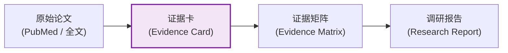
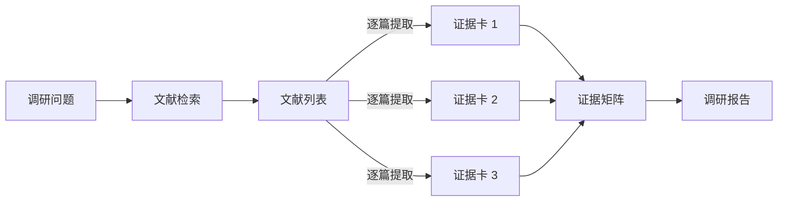
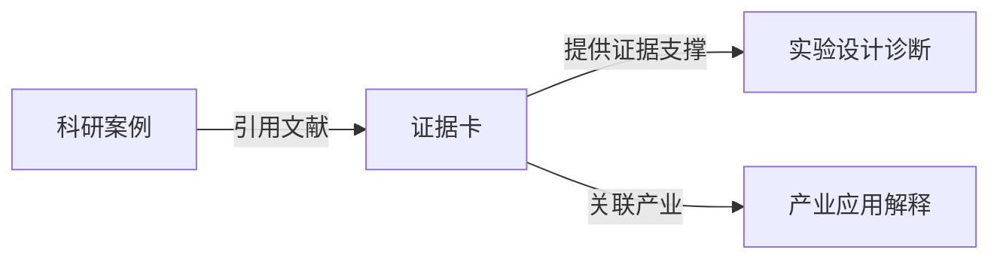

# BioMentor 证据卡设计文档

> 本文档定义 BioMentor 平台的核心数据结构——**证据卡（Evidence Card）** 的设计理念、字段规范和教学分级标准。

---

## 1. 为什么证据卡是核心中间层

### 1.1 问题背景

在传统的科研训练中，学生面临以下困境：

| 问题 | 具体表现 |
|------|---------|
| **学生直接看 PubMed 很难** | 本科生/低年级研究生缺乏学术阅读经验，面对 PubMed 检索结果中的大量论文标题和摘要，难以快速判断哪些文献与自己的调研问题相关，更难从摘要中提取关键信息 |
| **系统不能只给论文列表** | 如果 BioMentor 只返回一个论文列表（标题 + PMID + 摘要链接），学生仍然需要自行阅读和理解，这等于把困难原封不动地推回给学生，系统没有提供实质性的教学辅助 |
| **每篇文献需要结构化转化** | 不同论文的研究问题、方法体系、证据强度差异很大，需要统一的结构化框架来呈现，才能进行跨文献的对比分析 |
| **多篇文献需要汇总视角** | 单篇论文只能提供局部视角，学生需要看到多篇文献的共识和矛盾，才能形成对研究领域的整体理解 |

### 1.2 证据卡的定位

证据卡是 BioMentor 平台的**核心中间层数据结构**，它位于"原始论文"和"学生理解"之间：



**证据卡不是摘要（Abstract）**。摘要是对论文内容的客观概述，而证据卡是面向教学场景的结构化信息提取，其核心目的是：

1. **训练学生理解研究问题**：通过 `research_question` 字段，引导学生关注"这篇论文到底在回答什么问题"
2. **建立证据意识**：通过 `evidence_strength` 分级，让学生理解不同研究的证据强度差异
3. **连接课程与前沿**：通过 `relation_to_course` 和 `relation_to_industry` 字段，帮助学生将课堂知识与科研前沿和产业应用关联
4. **培养批判性思维**：通过 `limitations` 字段，引导学生关注每项研究的局限性

### 1.3 证据卡与证据矩阵的关系

- **单张证据卡**：对一篇文献的结构化提取，回答"这篇论文说了什么、证据有多强"
- **证据矩阵**：多篇证据卡的汇总对比，回答"这个领域的整体证据情况如何、哪些结论有共识、哪些存在争议"

```
证据卡 1 ──┐
证据卡 2 ──┼──> 证据矩阵 ──> 调研报告
证据卡 3 ──┘
```

---

## 2. 证据卡字段规范

### 2.1 完整字段列表

| 字段名 | 类型 | 必填 | 说明 |
|--------|------|------|------|
| `card_id` | string | 是 | 证据卡唯一标识符 |
| `knowledge_point_id` | string | 是 | 关联的知识点 ID |
| `query_intent` | string | 是 | 调研意图描述（学生想了解什么） |
| `title` | string | 是 | 论文标题 |
| `paper_identifier` | string | 是 | 论文标识（PMID / DOI / mock_pmid） |
| `paper_type` | string | 是 | 论文类型（research_article / review / meta_analysis / preprint / clinical_trial） |
| `study_system` | string | 是 | 研究体系（如"人类 HEK293T 细胞"、"小鼠模型"等） |
| `research_question` | string | 是 | **核心字段** - 该论文试图回答的研究问题 |
| `core_methods` | string | 是 | 核心实验方法（2-3 句话概括） |
| `key_findings` | string | 是 | 关键发现（结构化列出 2-4 条） |
| `evidence_anchor` | string | 是 | **核心字段** - 支撑结论的关键证据（具体数据、统计结果） |
| `relation_to_course` | string | 是 | 与课程知识点的关联说明 |
| `relation_to_industry` | string | 是 | 与产业应用的关联说明 |
| `limitations` | string | 是 | **核心字段** - 研究局限性（必须填写） |
| `evidence_strength` | enum | 是 | 证据强度分级（见 2.2 节） |
| `source_refs` | array | 是 | 参考来源列表 |
| `extraction_status` | string | 是 | 提取状态（draft / reviewed / verified） |
| `demo_only` | boolean | 是 | 是否仅为演示数据 |
| `not_real_benchmark` | boolean | 是 | 是否非真实基准数据 |
| `requires_teacher_review` | boolean | 是 | 是否需要教师审核 |

### 2.2 核心字段详解

#### research_question（研究问题）

**为什么重要**：这是证据卡最重要的字段之一。很多学生读论文时只关注结论，而忽略了"这篇论文到底在回答什么问题"。通过显式提取研究问题，训练学生形成"问题导向"的阅读习惯。

**填写规范**：
- 用一句话概括论文的核心研究问题
- 避免照搬论文标题（标题通常是结论导向的）
- 示例："CRISPR-Cas9 在人类胚胎中的脱靶编辑频率是否在临床可接受范围内？"

#### evidence_anchor（证据锚点）

**为什么重要**：证据锚点是将"结论"和"数据"连接起来的桥梁。学生需要理解结论不是凭空产生的，而是由具体的实验数据支撑的。

**填写规范**：
- 提取支撑核心结论的关键实验数据
- 包含具体的数值、统计方法和 p 值
- 示例："在 30 个人类胚胎样本中，脱靶编辑频率为 0.05%（95% CI: 0.01%-0.12%），显著低于之前报道的 1.2%（p < 0.001）"

#### limitations（研究局限性）

**为什么重要**：每项研究都有局限性，理解局限性是科学素养的核心组成部分。强制填写此字段，防止学生盲目接受论文结论。

**填写规范**：
- 至少列出 2 条局限性
- 从样本量、实验模型、方法学、统计方法等角度分析
- 示例："1) 样本量较小（n=30），统计效力有限；2) 仅使用体外培养的胚胎模型，未在体内验证；3) 脱靶检测方法的灵敏度可能不足以发现低频编辑事件"

#### relation_to_course（课程关联）

**填写规范**：
- 明确指出该论文涉及哪些课程知识点
- 说明论文内容如何帮助理解或拓展课程知识
- 示例："本论文涉及课程第 5 章的 CRISPR-Cas9 基因编辑机制，展示了 sgRNA 设计对脱靶效应的影响，拓展了课堂讲授的'特异性'概念"

#### relation_to_industry（产业关联）

**填写规范**：
- 说明该研究的产业转化潜力
- 指出相关的产业应用方向
- 示例："该研究为 CRISPR 基因治疗的临床安全性评估提供了数据支持，直接关联到基因治疗 CDMO 行业的质量控制标准"

---

## 3. evidence_strength 教学分级

### 3.1 分级定义

| 等级 | 标识 | 定义 | 教学说明 |
|------|------|------|---------|
| **Background** | `background` | 背景知识类文献，如教材、综述中的背景介绍 | 提供基础知识框架，不直接支撑具体结论 |
| **Preliminary** | `preliminary` | 初步证据，如体外实验、小样本研究、预印本 | 有参考价值但证据强度有限，结论需谨慎对待 |
| **Moderate** | `moderate` | 中等强度证据，如动物模型实验、中等样本量的临床研究 | 可以作为论据使用，但需注意适用范围 |
| **Strong** | `strong` | 强证据，如大样本 RCT、多中心临床研究、系统性综述/Meta 分析 | 证据强度高，可以作为可靠论据 |
| **Teacher Review Required** | `teacher_review_required` | 证据强度无法自动判断，需要教师审核 | 系统无法确定证据强度，标记为待审核 |

### 3.2 分级判定规则

系统在生成证据卡时，根据以下规则自动判定证据强度：

```text
IF paper_type == "review" OR paper_type == "textbook":
    evidence_strength = "background"
ELSE IF paper_type == "preprint":
    evidence_strength = "preliminary"
ELSE IF paper_type == "meta_analysis" AND sample_size > 1000:
    evidence_strength = "strong"
ELSE IF paper_type == "clinical_trial" AND is_randomized AND sample_size > 200:
    evidence_strength = "strong"
ELSE IF study_system IN ["animal_model", "cell_line"] AND sample_size >= 3:
    evidence_strength = "moderate"
ELSE IF study_system == "in_vitro" AND sample_size < 3:
    evidence_strength = "preliminary"
ELSE:
    evidence_strength = "teacher_review_required"
```

> **注意**：以上规则仅为初步判定逻辑，实际实现中需要更细致的规则和教师审核机制。

### 3.3 教学意义

证据强度分级的教学目的：

1. **培养证据意识**：让学生理解不同类型研究的证据强度差异
2. **引导合理引用**：在撰写调研报告时，学生需要根据证据强度合理引用文献
3. **支撑证据矩阵**：证据矩阵中的 `evidence_strength_summary` 字段基于各证据卡的强度汇总

---

## 4. Demo / Mock 证据卡声明

### 4.1 核心原则

> **如果没有真实查证，只能生成 demo/mock 证据卡，不能冒充真实论文。**

这是 BioMentor 平台的底线原则。任何由 AI 自动生成但未经真实文献验证的证据卡，必须明确标记为演示数据。

### 4.2 强制标记字段

所有 demo/mock 证据卡必须包含以下标记：

| 字段 | 值 | 说明 |
|------|---|------|
| `demo_only` | `true` | 标记为演示数据 |
| `not_real_benchmark` | `true` | 标记为非真实基准数据 |
| `requires_teacher_review` | `true` | 标记为需要教师审核 |
| `paper_identifier` | `MOCK-XXX-NNN` | 使用 mock 标识符，禁止使用真实 PMID |
| `extraction_status` | `draft` | 标记为草稿状态 |

### 4.3 前端展示要求

- 所有包含 `demo_only: true` 的证据卡，前端必须显示醒目的 **"DEMO 数据"** 标签
- 证据卡详情页顶部必须显示声明："本证据卡为 AI 生成的演示数据，不代表真实论文内容。仅供教学演示使用，不可作为学术引用依据。"
- 禁止在 demo 证据卡中显示"已验证"或"已审核"状态

### 4.4 真实证据卡的生成流程

```
PubMed 检索 --> 获取真实 PMID + 摘要 --> AI 辅助提取 --> 教师审核 --> 标记 verified
```

只有经过教师审核确认的证据卡，才能将 `extraction_status` 更新为 `verified`，并将 `demo_only` 设为 `false`。

---

## 5. 证据卡在闭环中的使用

### 5.1 在文献探索闭环中



### 5.2 在科研案例闭环中



### 5.3 证据卡的质量控制

| 阶段 | 质量控制措施 |
|------|-------------|
| 生成阶段 | AI 提取后自动检查必填字段是否完整 |
| 审核阶段 | 教师审核 evidence_strength 分级是否合理 |
| 使用阶段 | 学生可以对证据卡提出疑问，触发重新审核 |
| 归档阶段 | 定期检查证据卡的时效性（论文是否被撤回等） |
