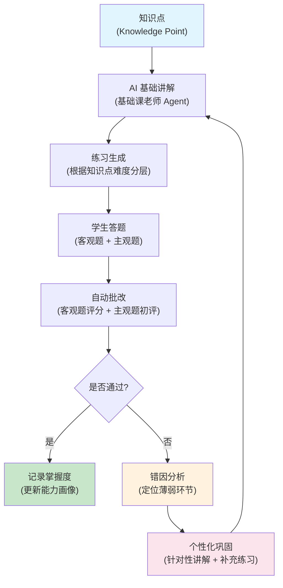
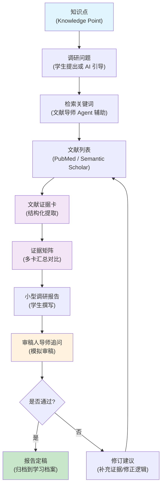
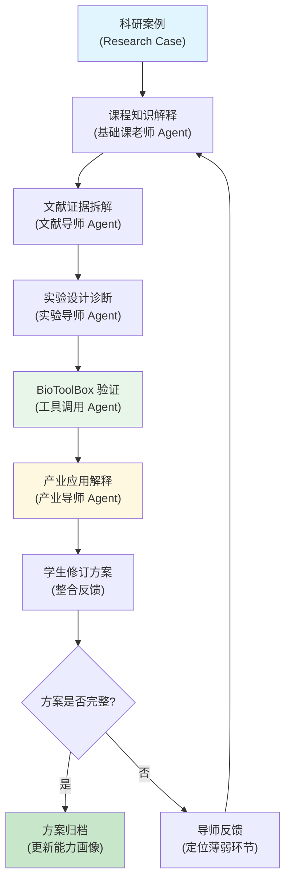
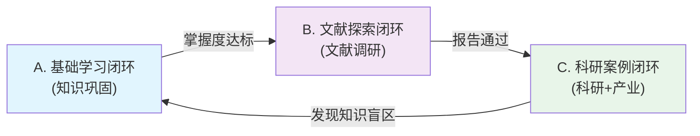

# BioMentor 科研训练闭环工作流

> 本文档定义 BioMentor Agent 平台的三条核心闭环工作流。每条闭环对应一种科研训练场景，形成"学习-实践-反馈-巩固"的完整循环。

---

## 闭环总览

BioMentor 的科研训练体系由三条相互关联的闭环组成：

| 闭环 | 核心目标 | 主要参与者 | 产出物 |
|------|---------|-----------|--------|
| A. 基础学习闭环 | 巩固课程知识点 | 基础课老师 Agent + 学生 | 答题记录、错因分析、个性化巩固方案 |
| B. 文献探索闭环 | 培养文献调研能力 | 文献导师 Agent + 审稿人导师 Agent | 证据卡、证据矩阵、小型调研报告 |
| C. 科研案例与产业应用闭环 | 连接科研与产业 | 实验导师 Agent + 产业导师 Agent | 实验设计方案、产业应用分析、修订方案 |

---

## A. 基础学习闭环

### 设计理念

基础学习闭环是整个科研训练的基石。学生从课程知识点出发，通过 AI 辅助讲解理解核心概念，再通过练习和答题检验掌握程度。系统自动批改后进行错因分析，最终生成个性化的巩固方案，形成完整的学习闭环。

### 流程图

### 各环节说明

| 环节 | 说明 | Agent/系统角色 |
|------|------|---------------|
| 知识点 | 从课程知识库中选取当前学习单元的核心知识点 | 系统自动推送 |
| AI 基础讲解 | 基础课老师 Agent 根据学生水平生成分层讲解（基础/进阶/拓展） | 基础课老师 Agent |
| 练习生成 | 根据知识点生成不同难度的练习题，包含客观题和主观题 | 基础课老师 Agent |
| 学生答题 | 学生在平台上完成练习，支持限时和无限时两种模式 | 学生 |
| 自动批改 | 客观题自动评分，主观题由 AI 给出初评分数和评语 | 系统评分 + AI 辅助 |
| 错因分析 | 对错误题目进行归因分析（概念混淆/计算错误/理解偏差等） | 能力诊断 Agent |
| 个性化巩固 | 根据错因生成针对性巩固材料，推送相关知识点复习 | 基础课老师 Agent |

### 闭环触发条件

- **自动触发**：每次课程单元结束后自动进入闭环
- **手动触发**：学生主动选择知识点进行复习
- **教师触发**：教师针对班级薄弱知识点推送巩固任务

---

## B. 文献探索闭环

### 设计理念

文献探索闭环训练学生的学术调研能力。学生围绕一个课程知识点提出调研问题，系统辅助进行文献检索和证据提取，最终形成结构化的调研报告。审稿人导师 Agent 模拟真实学术审稿过程，通过追问帮助学生深化理解。

### 流程图

### 各环节说明

| 环节 | 说明 | Agent/系统角色 |
|------|------|---------------|
| 知识点 | 选择需要深入调研的课程知识点 | 学生选择 |
| 调研问题 | 围绕知识点提出具体的调研问题（如"CRISPR-Cas9 在基因治疗中的脱靶效应如何评估？"） | 学生提出 + 文献导师 Agent 引导 |
| 检索关键词 | 将调研问题拆解为检索关键词和布尔逻辑表达式 | 文献导师 Agent |
| 文献列表 | 通过 PubMed E-utilities 等接口检索相关文献，返回标题、摘要、PMID 等 | 工具调用 Agent |
| 文献证据卡 | 对每篇文献进行结构化提取，生成证据卡（详见 [证据卡设计文档](./BIOMENTOR_EVIDENCE_CARD_DESIGN.md)） | 文献导师 Agent |
| 证据矩阵 | 将多篇证据卡汇总为证据矩阵，展示共识发现、矛盾发现和证据强度 | 文献导师 Agent |
| 小型调研报告 | 学生基于证据矩阵撰写结构化调研报告 | 学生撰写 |
| 审稿人导师追问 | 审稿人导师 Agent 模拟同行评审，提出质疑和补充要求 | 审稿人导师 Agent |
| 报告定稿 | 通过审稿后归档，更新学生文献调研能力评分 | 系统 |

### 闭环触发条件

- **自动触发**：课程知识点学习达到一定掌握度后解锁
- **手动触发**：学生主动发起文献调研任务
- **教师触发**：教师布置文献调研作业

### 关键设计原则

1. **证据卡是核心中间层**：学生不直接阅读原始论文全文，而是通过结构化证据卡理解文献核心内容
2. **证据矩阵提供全局视角**：多篇证据卡的汇总对比帮助学生建立对研究领域的整体认知
3. **审稿人追问模拟真实学术环境**：训练学生应对学术质疑的能力

---

## C. 科研案例与产业应用闭环

### 设计理念

科研案例与产业应用闭环将学术研究与产业实践连接起来。学生通过分析真实科研案例，理解课程知识在科研和产业中的应用。实验导师 Agent 辅助实验设计诊断，产业导师 Agent 解释产业转化路径，BioToolBox 提供工具验证支持。

### 流程图

### 各环节说明

| 环节 | 说明 | Agent/系统角色 |
|------|------|---------------|
| 科研案例 | 从案例库中选择与当前知识点相关的科研案例（如"CAR-T 细胞疗法的靶点选择策略"） | 系统推荐 / 教师指定 |
| 课程知识解释 | 将案例中涉及的知识点与课程内容关联讲解 | 基础课老师 Agent |
| 文献证据拆解 | 将案例引用的关键文献拆解为证据卡，帮助学生理解研究脉络 | 文献导师 Agent |
| 实验设计诊断 | 分析案例中的实验设计逻辑，诊断优势和不足 | 实验导师 Agent |
| BioToolBox 验证 | 使用生物信息学工具（蛋白结构、通路分析、序列分析等）验证案例中的关键结论 | 工具调用 Agent |
| 产业应用解释 | 将案例中的科研成果与产业转化路径关联，解释商业化逻辑 | 产业导师 Agent |
| 学生修订方案 | 学生整合所有反馈，修订自己的理解和方案 | 学生 |
| 方案归档 | 归档最终方案，更新学生的实验设计和产业转化能力评分 | 系统 |

### 闭环触发条件

- **自动触发**：完成文献探索闭环后解锁相关科研案例
- **手动触发**：学生主动选择科研案例进行分析
- **教师触发**：教师布置案例分析作业

### BioToolBox 在闭环中的角色

BioToolBox 是本闭环的**辅助验证层**，提供以下工具支持：

| 工具类别 | 验证场景 | 对应闭环环节 |
|---------|---------|-------------|
| 蛋白结构分析 | 验证靶点蛋白的结构特征和结合位点 | 实验设计诊断 |
| 通路网络分析 | 验证信号通路中的关键节点和调控关系 | 课程知识解释 |
| 序列分析 | 验证基因编辑靶点的序列特征 | 实验设计诊断 |

> 详见 [BioToolBox 路线图](./BIOMENTOR_BIOTOOLBOX_ROADMAP.md)

---

## 三条闭环的关系

- **A -> B**：基础学习闭环达标后，解锁文献探索闭环，学生开始围绕知识点进行深入调研
- **B -> C**：文献探索闭环完成后，解锁科研案例闭环，学生将文献调研能力应用到案例分析中
- **C -> A**：科研案例闭环中发现的 knowledge gap 反馈到基础学习闭环，形成更大的循环

---

## 闭环的数据流

每条闭环都会产生结构化数据，这些数据用于更新学生的能力画像和教师的教学决策：

| 闭环 | 产出数据 | 更新的能力维度 |
|------|---------|---------------|
| A. 基础学习 | 答题记录、错因分析、巩固方案 | knowledge_mastery |
| B. 文献探索 | 证据卡、证据矩阵、调研报告 | literature_search, paper_understanding, evidence_judgment |
| C. 科研案例 | 实验设计方案、产业分析、修订方案 | experiment_design, industry_transfer, mechanism_explanation |

> 能力维度定义详见 [Agent 角色文档](./BIOMENTOR_AGENT_ROLES.md) 中的能力诊断 Agent 部分。
